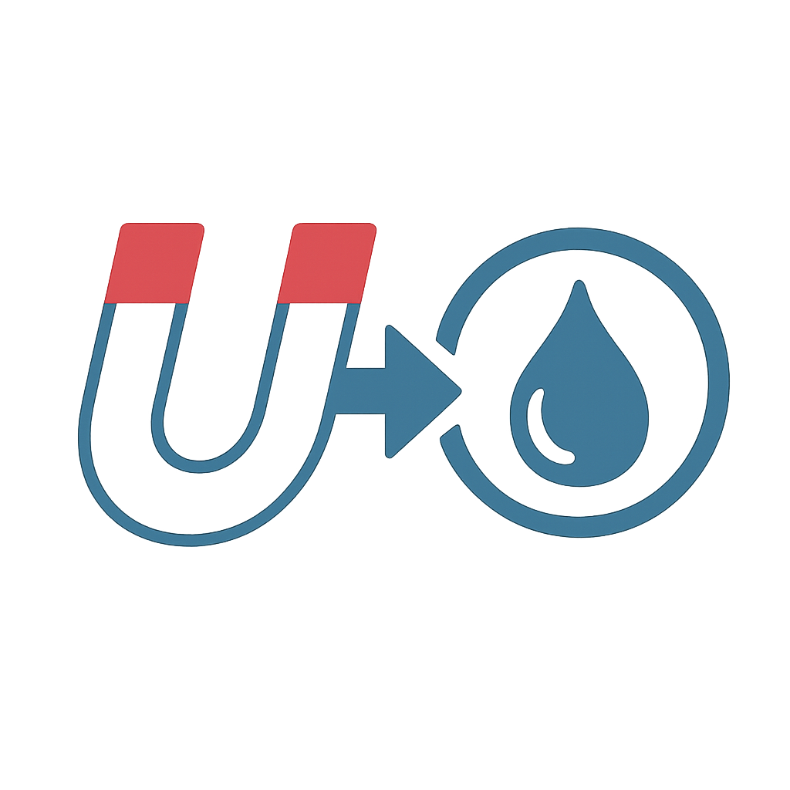

  

# Magnet2Deluge

A browser extension that redirects magnet links to your Deluge torrent client, allowing you to easily add torrents without manually copying and pasting magnet URLs.

## Features

- **Direct Click Detection**: Click any magnet link to automatically send it to Deluge (Can be disabled in settings)
- **Context Menu**: Right-click magnet links for manual control
- **Visual Feedback**: Modals show success, error, or "already added" status
- **Connection Testing**: Test your Deluge connection directly from the settings
- **Settings Management**: Easy configuration of Deluge URL and password

## Getting Started

1. Click the extension icon to open the settings popup
2. Enter your Deluge Web UI URL (e.g., `http://localhost:8112`)
3. Enter your Deluge password
4. Click "Test Connection" to verify your settings
5. Click "Save" to store your configuration

## Usage

### Direct Click (Enabled by default)
- Simply click any magnet link on any webpage
- The extension will automatically send it to Deluge
- A colored modal will appear showing the result:
  - **Green**: Successfully added to Deluge
  - **Orange**: Already in Deluge session
  - **Red**: Error occurred

### Context Menu
- Right-click any magnet link
- Select "Send magnet to Deluge" from the context menu

## Requirements

- Compatible browser
- Deluge torrent client with Web UI enabled
- Deluge Web UI accessible via HTTP/HTTPS

## Troubleshooting

- **"Deluge settings missing"**: Make sure you've configured the URL and password in the extension settings
- **"Connection error"**: Verify your Deluge Web UI is running and accessible
- **"Authentication failed"**: Check your Deluge password
- **Magnet links still open in browser**: Ensure "Direct Click Detection" is enabled in settings
